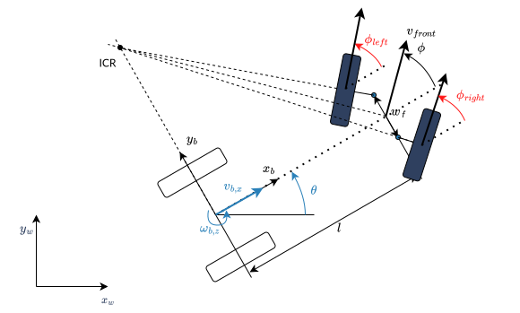
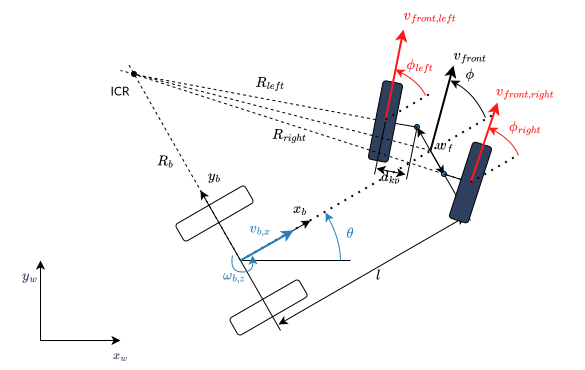

# ackermann_ros2

Ackermann Steering Kinematic from [ros2 controllers](https://control.ros.org/master/doc/ros2_controllers/doc/mobile_robot_kinematics.html#mobile-robot-kinematics)

## Ackermann Steering

The following image shows a four-wheeled robot with two independent
steering wheels in the front.



-   $w_f$ is the wheel track of the front axle, measured between the two
    kingpins.

To prevent the front wheels from slipping, the steering angle of the
front wheels cannot be equal. This is the so-called **Ackermann
steering**.

> [!NOTE]
> Ackermann steering can also be achieved by a [mechanical linkage between the two front wheels](https://en.wikipedia.org/wiki/Ackermann_steering_geometry). In this case the robot has only one steering input, and the steering angle of the two front wheels is mechanically coupled. The inverse kinematics of the robot will then be the same as in the car-like model above.

**Forward Kinematics**

The forward kinematics is the same as for the car-like model above.

**Inverse Kinematics**

The turning radius of the robot is

$$R_b = \frac{l}{\tan(\phi)}$$

Then the steering angles of the front wheels must satisfy these
conditions to avoid skidding

$$\begin{aligned}
\phi_{left} &= \arctan\left(\frac{l}{R_b - w_f/2}\right) &= \arctan\left(\frac{2l\sin(\phi)}{2l\cos(\phi) - w_f\sin(\phi)}\right)\\
\phi_{right} &= \arctan\left(\frac{l}{R_b + w_f/2}\right) &= \arctan\left(\frac{2l\sin(\phi)}{2l\cos(\phi) + w_f\sin(\phi)}\right)
\end{aligned}$$

**Odometry**

The calculation of $\phi$ from two angle measurements of the steering
axle is overdetermined. If there is no slip and the measurements are
ideal,

$$\phi = \arctan\left(\frac{l\tan(\phi_{left})}{l + w_f/2 \tan(\phi_{left})}\right) = \arctan\left(\frac{l\tan(\phi_{right})}{l - w_f/2 \tan(\phi_{right})}\right)$$

holds. But to get a more robust solution, we take the average of both ,
i.e.,

$$\phi = 0.5 \left(\arctan\left(\frac{l\tan(\phi_{left})}{l + w_f/2 \tan(\phi_{left})}\right) + \arctan\left(\frac{l\tan(\phi_{right})}{l - w_f/2 \tan(\phi_{right})}\right)\right).$$

### Ackermann Steering with Traction

The following image shows a four-wheeled car-like robot with two
independent steering wheels at the front, which are also driven
independently.



-   $d_{kp}$ is the distance from the kingpin to the contact point of
    the front wheel with the ground.

**Forward Kinematics**

The forward kinematics is the same as the car-like model above.

**Inverse Kinematics**

To avoid slipping of the front wheels, the velocity of the front wheels
cannot be equal and

$$\frac{v_{front,left}}{R_{left}} = \frac{v_{front,right}}{R_{right}} = \frac{v_{b,x}}{R_b}$$

with turning radius of the robot and the left/right front wheel

$$\begin{aligned}
R_b       &= \frac{l}{\tan(\phi)} \\
R_{left}  &= \frac{l-d_{kp}\sin(\phi_{left})}{\sin(\phi_{left})}\\
R_{right} &= \frac{l+d_{kp}\sin(\phi_{right})}{\sin(\phi_{right})}.
\end{aligned}$$

This results in the following inverse kinematics equations

$$\begin{aligned}
v_{front,left} &= \frac{v_{b,x}(l-d_{kp}\sin(\phi_{left}))}{R_b\sin(\phi_{left})}\\
v_{front,right} &= \frac{v_{b,x}(l+d_{kp}\sin(\phi_{right}))}{R_b\sin(\phi_{right})}
\end{aligned}$$

with the steering angles of the front wheels from the Ackermann steering
equations above.

**Odometry**

The calculation of $v_{b,x}$ from two encoder measurements of the
traction axle is again overdetermined. If there is no slip and the
encoders are ideal,

$$v_{b,x} = v_{front,left} \frac{R_b\sin(\phi_{left})}{l-d_{kp}\sin(\phi_{left})} =  v_{front,right} \frac{R_b\sin(\phi_{right})}{l+d_{kp}\sin(\phi_{right})}$$

holds. But to get a more robust solution, we take the average of both ,
i.e.,

$$v_{b,x} = 0.5 \left( v_{front,left} \frac{R_b\sin(\phi_{left})}{l-d_{kp}\sin(\phi_{left})} +  v_{front,right} \frac{R_b\sin(\phi_{right})}{l+d_{kp}\sin(\phi_{right})}\right).$$

---

## Proyecto Simulación con ROS2

- ROS2 [ROS2 Documentation](https://docs.ros.org/en/iron/Installation/Ubuntu-Install-Debians.html) (Seguir Desktop Install)
- Gazebo ```sudo apt install ros-<version_ros>-gazebo-ros-pkgs```
- Xacro ```sudo apt install ros-<version_ros>-xacro```
- <version_ros>: Actualmente se esta empleando **iron**

> [!IMPORTANT]
> Para utlizar ROS2, siempre hacer source ROS2 en cada nueva terminal ```source /opt/ros/iron/setup.bash```

### URDF

  - [ackermann xacro](https://github.com/abarbierif/ackermann_ros2/blob/main/ackermann_robot/urdf/ackermann.xacro)

### XACRO

  - [ackermann.xacro](https://github.com/abarbierif/ackermann_ros2/blob/main/ackermann_robot/urdf/ackermann.xacro) Archivo que modela la estructura del robot
  - [params.xacro](https://github.com/abarbierif/ackermann_ros2/blob/main/ackermann_robot/urdf/params.xacro) Archivo que contiene parámetros del robot

### RVIZ
  - El archivo de lanzamiento en ***python*** es creado en un **paquete** de ROS. Para más información sobre la creación de paquetes y su compilación ver [creating a package](https://docs.ros.org/en/iron/Tutorials/Beginner-Client-Libraries/Creating-Your-First-ROS2-Package.html)
  
  - Para la visualización mediante los ***nodos*** ```robot_state_publisher```, ```joint_state_publisher``` y ```rviz2``` se realizó el siguiente launch file [visualization.launch.py](https://github.com/abarbierif/ackermann_ros2/blob/main/ackermann_robot/launch/visualization.launch.py)

> [!NOTE]
>  La variable ```urdf_path``` en la línea 8 debe ser modificado a la ruta del archivo ```.xacro```

> [!NOTE]
>  La ruta al archivo ```config.rviz``` debe ser modificada por la ruta de un archivo de ocnfiguración de **RVIZ** previamente creado o en su defecto eliminar la opción del comando, en ese caso la configuración debe realizarse de forma manual una vez abierto **RVIZ**

  comandos de ejecución:
    
  ```
  cd <workspace>
  source install/local_setup.bash
  ros2 launch ackermann_robot visualization.launch.py
  ```
    
  La visualización del robot es:\
  
  Utilizando ```rqt_graph``` se visualiza el siguiente grafo:\
  
    
### GAZEBO

- Para añadir un **nodo** de control se utliza el driver ```libgazebo_ros_ackermann_drive.so```, este es vinculado al robot con el siguiente archivo [gazebo.xacro](https://github.com/abarbierif/ackermann_ros2/blob/main/ackermann_robot/urdf/gazebo.xacro). Para modularizar los componentes del robot se utliza el archivo [robot.xacro](https://github.com/abarbierif/ackermann_ros2/blob/main/ackermann_robot/urdf/robot.xacro) (archivo principal que integra los componentes del robot)

- Para la visualización mediante los ***nodos*** ```robot_state_publisher```, ```spawn_entity``` y ```gazebo``` se realizó el siguiente launch file [visualization.launch.py](https://github.com/abarbierif/ackermann_ros2/blob/main/ackermann_robot/launch/gazebo.launch.py). Adicionalmente, también se agregó el nodo ```rviz2```

> [!NOTE]
> La variable ```urdf_path``` en la línea 12 debe ser modificado a la ruta del archivo ```.xacro```

> [!NOTE]
> La ruta al archivo ```config_lidar.rviz``` debe ser modificada por la ruta de un archivo de ocnfiguración de **RVIZ** previamente creado o en su defecto eliminar la opción del comando, en ese caso la configuración debe realizarse de forma manual una vez abierto **RVIZ**
  

#### Sensor LIDAR

- Para agregar un sensor tipo **LIDAR** se utiliza el driver ```libgazebo_ros_ray_sensor.so```, vinculado al robot en el archivo [lidar.xacro](https://github.com/abarbierif/ackermann_ros2/blob/main/ackermann_robot/urdf/lidar.xacro). El driver envía mensajes del tipo ```LaserScan``` a través del tópico ```scan```.

  comandos de ejecución:
    
    ```
    cd <workspace>
    source install/local_setup.bash
    ros2 launch ackermann_robot gazebo.launch.py
    ```
    
> [!WARNING]
> Para visualizar el sensor en RVIZ es necesario añadir la visualización manualmente con el mensaje tipo ```LaserScan``` y luego vincularlo al tópico ```scan```. 
    
  La visualización del robot en GAZEBO es:\
  
  Los datos del sensor LIDAR en RVIZ:
  
  Utilizando ```rqt_graph``` se visualiza el siguiente grafo:
  
  
